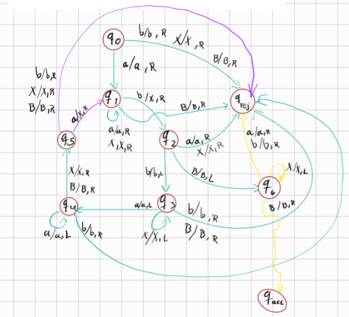
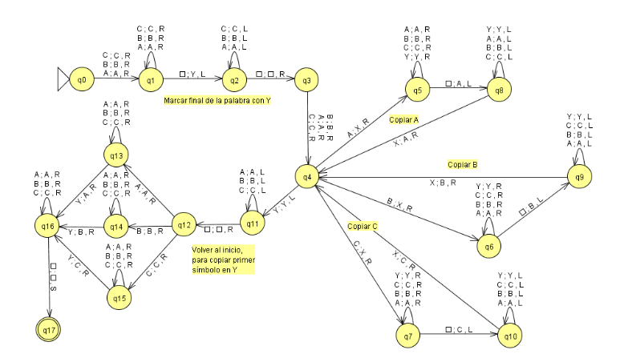

# Simulador de máquinas de Turing 

Este proyecto implementa un simulador de *Máquinas de Turing* que puede ejecutar tanto *máquinas reconocedoras* como *máquinas transformadoras*. 
La *máquina transformadora* altera el contenido de la cinta de entrada según reglas definidas en un archivo YAML en este caso con un alfabeto definido con letras D,J,K. Puedes poner cualquier cadena con esas letras y te duplicara la entrada.
La *máquina reconocedora* reconoce cadenas del tipo {𝑎^n  𝑏^n  | 𝑛 ≥ 1} . 

## Ejemplos:
1. *máquina transformadora*:  Input: DJK. Output DJKDJK.

2. *máquina reconocedora*: Input: aaabbb. Output: cadena aaabbb aceptada. Input: aabbb. Output: cadena aabbb rechazada.

## Video de ejecucion:
https://youtu.be/TAIwxIycN7Y 

## *Descripción General*
Diagrama de control de estados para la *máquina reconocedora*: 
.

Diagrama de control de estados para la *máquina transformadora*: 
.


El simulador permite:
1. Leer la configuración de una máquina desde un archivo YAML.
2. Ejecutar la máquina para procesar cadenas de entrada.
3. Mostrar el estado de la cinta después de cada paso.
4. Reportar el resultado final de la simulación.

### *Tipos de Máquina Soportados*
- *Reconocedora*: Acepta o rechaza cadenas en función de un patrón definido.
- *Transformadora*: Modifica la cinta de entrada y produce una nueva cinta transformada.

## *Estructura del Proyecto*

El proyecto contiene los siguientes archivos:

- Reader.py: Se encarga de leer y procesar la configuración desde el archivo YAML.
- MT.py: Implementa la lógica de la Máquina de Turing.
- index.py: Punto de entrada para ejecutar la simulación.
- reconocedora.yml: Ejemplo de configuración para una máquina reconocedora.
- transformadora.yml: Ejemplo de configuración para una máquina transformadora.
- README.md: Este archivo, que describe cómo usar el proyecto.


## *Requisitos*

1. *Python 3.8+*
2. *Biblioteca pyyaml*

### Instalación de Dependencias
```bash
pip install pyyaml
```
